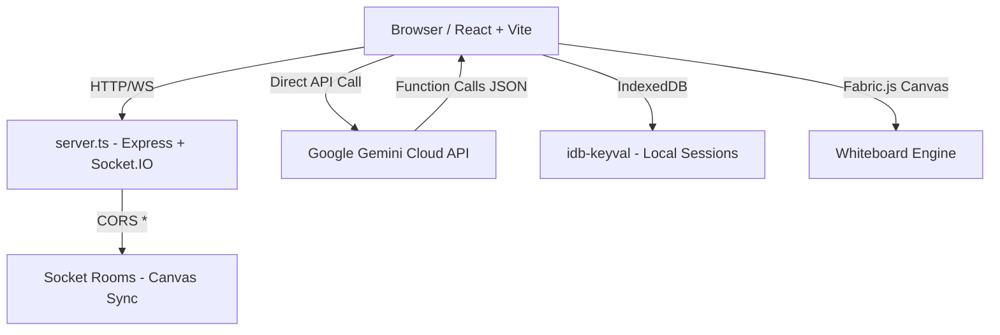
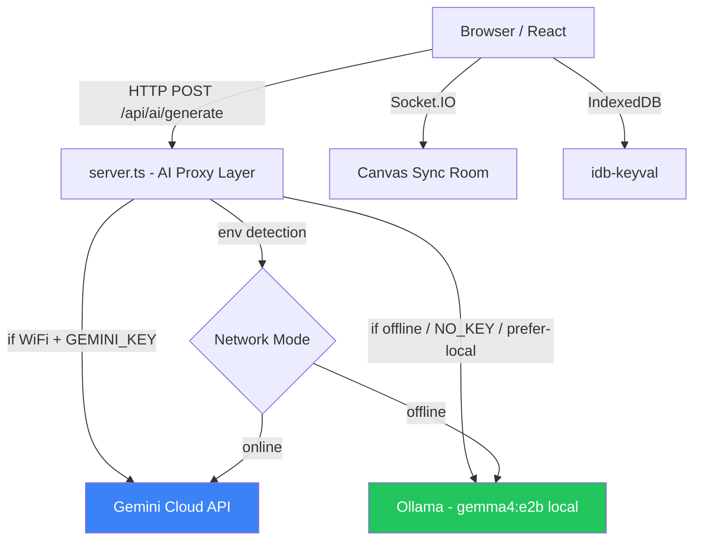

# Smartboard Teach AI — Full Implementation Plan
## WiFi + Offline (Ollama `gemma4:e2b` CPU), Lightness, Bug Fixes & Refactorization

**Status: ACTIVE DEVELOPMENT**  
**Last Updated: May 9, 2026**

---

## 📋 Analisis Sistem Saat Ini (Jujur, No Lie)

### Arsitektur Sekarang



**Flow utama:**
1. Guru ketik/bicara → `useGeminiBrain.ts` → kirim screenshot canvas + prompt ke Gemini Cloud
2. Gemini jawab dengan **function calls** (JSON tool use)
3. `useAgentProcessor.ts` execute actions satu per satu (cursor animation + canvas mutations)
4. Socket.IO broadcast perubahan canvas ke viewer (murid)
5. Session disimpan ke IndexedDB browser

### Yang Sudah Berjalan dengan Baik ✅
- Infinite whiteboard (Fabric.js)
- Agentic tool use (mindmap, quiz, component rendering)
- Real-time sharing via Socket.IO
- Multi-page board
- IndexedDB persistence (save/load session)
- Animated agent cursor (Bezier physics)
- Voice input (Web Speech API)
- File upload + image analysis

---

## 🔴 Bug Nyata & Masalah yang Ditemukan

> [!CAUTION]
> Berikut adalah bug dan masalah nyata yang ditemukan dari membaca kode — **bukan spekulasi**

### Bug #1 — `API_KEY` tidak pernah di-set di frontend
```typescript
// services/geminiService.ts:5
const ai = new GoogleGenAI({ apiKey: process.env.API_KEY });
```
`process.env` di browser (Vite) hanya expose variable dengan prefix `VITE_`. 
`process.env.API_KEY` akan selalu `undefined` di production build. 
**Seharusnya:** `import.meta.env.VITE_API_KEY` atau inject dari server-side proxy.

### Bug #2 — Model name salah / tidak konsisten
```typescript
// constants.ts:1
export const GEMINI_MODEL = 'gemini-3-flash-preview';

// geminiService.ts:474 (generateToolContent)
const model = "gemini-3.1-flash-preview"; // berbeda!

// geminiService.ts:516 (transcribeAudio)
model: "gemini-3-flash-preview", // lagi beda versi
```
Tiga tempat berbeda, dua format model name berbeda. Bisa menyebabkan error jika model tidak valid.

### Bug #3 — `CALCULATOR` component tidak fungsional
```typescript
// useGeminiBrain.ts:195-206
html = `... <button ...>7</button> ... <button ...>=</button> ...`;
```
HTML kalkulator yang di-generate adalah **dekoratif saja** — tidak ada event listener, tidak ada logika kalkulasi. Tombol tidak melakukan apa-apa.

### Bug #4 — `FLASHCARD` CSS class tidak valid di Tailwind
```typescript
html = `<div class="w-full h-full perspective-1000">
  <div class="... hover:rotate-y-180">`
```
`perspective-1000`, `transform-style-preserve-3d`, `backface-hidden`, `rotate-y-180` **bukan Tailwind class standar**. Ada inline `<style>` workaround tapi itu fragile dan tidak kompatibel semua browser tanpa prefix.

### Bug #5 — `useEffect` dependency array salah di `useSocketSync`
```typescript
// useSocketSync.ts:22
}, [canvasRef.current, isViewer]); // ❌ ref.current tidak stabil sebagai dep
```
React refs tidak trigger re-render. Deps array dengan `canvasRef.current` tidak akan berfungsi seperti yang diharapkan saat canvas baru di-set.

### Bug #6 — `generateToolContent` hard-coded model yang tidak ada di constants
```typescript
const model = "gemini-3.1-flash-preview"; // tidak pakai GEMINI_MODEL
```
Jika model ini tidak tersedia/di-rename, seluruh AI Tools view rusak tanpa fallback.

### Bug #7 — Memory leak di `useAgentProcessor`
```typescript
// useAgentProcessor.ts:514
const timer = setInterval(run, 100);
return () => clearInterval(timer);
```
`run` adalah closure yang di-recreate setiap render karena deps array `[actionQueue, canvasRef]`. Ini menyebabkan interval di-clear dan dibuat ulang setiap kali actionQueue berubah — setiap 100ms ada potensi multiple interval overlap saat perubahan state cepat.

### Bug #8 — `TIMER` component tidak fungsional
HTML timer yang di-generate juga tidak punya JavaScript yang terhubung ke tombol Start/Reset. Sama seperti kalkulator — murni display.

### Bug #9 — Server state rooms hilang saat restart
```typescript
const rooms = new Map<string, ...>();
```
State rooms disimpan in-memory. Server restart = semua room hilang. Viewer yang tersambung akan kehilangan canvas context.

### Bug #10 — `setFontSize` tidak ada tapi dipanggil di store
```typescript
// store.ts:83 (interface)
setFontFamily: (font: FontFamily) => void;
setFontSize: (size: number) => void;
// Padahal di bawah (line 343):
setFontFamily: (font) => set({ fontFamily: font }),
setFontSize: (size) => set({ fontSize: size }),
```
Ini sebenarnya ada — tapi `setBrushWidth` tidak ada di interface meski ada di implementasi. TypeScript tidak akan error tapi inconsistency ini berbahaya.

---

## 🟡 Masalah User Experience (UX) Saat Ini

### UX Problem #1 — "Mode Luring" label adalah BOHONG
Di header ada badge **"Mode Luring"** (offline mode) tapi sistem **100% bergantung pada internet** (Gemini Cloud API). Ini menyesatkan.

### UX Problem #2 — Tidak ada indikator ketika API gagal
Jika `API_KEY` salah atau internet mati, user hanya melihat pesan generic `"Sinkronisasi kognitif gagal."` tanpa context apa yang salah.

### UX Problem #3 — Tidak ada fallback saat AI tidak tersedia
Seluruh fitur utama (mindmap, quiz, canvas control) hanya bisa lewat AI. Tidak ada manual tool yang kuat sebagai fallback.

### UX Problem #4 — Voice input fragile
`Web Speech API` tidak tersedia di semua browser (Firefox tidak support). Tidak ada warning ke user.

### UX Problem #5 — Sidebar "Papan Tulis" toggle awkward di mobile
Di mobile (<1024px), sidebar bisa overlap canvas tanpa proper z-index management yang mulus.

---

## 🎯 Tujuan Implementasi Baru

| Fitur | Sekarang | Target |
|-------|----------|--------|
| AI Backend | Gemini Cloud only | Gemini Cloud **atau** Ollama lokal (`gemma4:e2b`) |
| Offline Mode | ❌ Tidak ada (label "Mode Luring" palsu) | ✅ Sepenuhnya berfungsi dengan Ollama |
| Network Detection | ❌ | ✅ Auto-switch berdasarkan koneksi |
| API Key Location | Browser env var (bug) | Server-side proxy |
| Model Config | Hard-coded di 3 tempat | Satu konstanta terpusat |
| Calculator Component | Display only (bug) | Fungsional |
| Timer Component | Display only (bug) | Fungsional |

---

## 📐 Arsitektur Baru yang Diusulkan



**Perubahan kunci:**
- `geminiService.ts` di frontend **tidak lagi panggil API langsung**
- Semua AI call lewat **server-side proxy** di `server.ts`
- Server yang memutuskan pakai Gemini atau Ollama berdasarkan env config + network status
- Frontend hanya kirim prompt + gambar, terima response

---

## 🗂️ Proposed Changes

### Phase 1 — Server: AI Proxy Layer (Critical)

#### [MODIFY] [server.ts](file:///c:/Users/X1%20CARBON/Downloads/smartboard-teach-ai/server.ts)
Tambahkan endpoint API proxy:
- `POST /api/ai/generate` — utama agent action generator
- `POST /api/ai/tool-content` — untuk AiToolsView
- `POST /api/ai/transcribe` — untuk audio transcription
- `GET /api/ai/status` — return backend mode (gemini/ollama) + health

Logic routing di server:
```typescript
// Pseudocode
const AI_MODE = process.env.AI_MODE || 'auto'; // 'gemini' | 'ollama' | 'auto'
const GEMINI_KEY = process.env.GEMINI_API_KEY;
const OLLAMA_URL = process.env.OLLAMA_BASE_URL || 'http://localhost:11434';
const OLLAMA_MODEL = process.env.OLLAMA_MODEL || 'gemma4:e2b';
const OLLAMA_THINKING_MODE = process.env.OLLAMA_THINKING_MODE || 'nothink';

async function routeAiRequest(req) {
  if (AI_MODE === 'ollama') return callOllama(req);
  if (AI_MODE === 'gemini' && GEMINI_KEY) return callGemini(req);
  // auto: prefer gemini if key exists, fallback ollama
  if (GEMINI_KEY) {
    try { return await callGemini(req); } 
    catch { return callOllama(req); } // fallback
  }
  return callOllama(req);
}
```

#### [NEW] server/ollamaAdapter.ts
Adapter untuk Ollama API (`/api/chat` endpoint):
- Translate tool/function call format dari Gemini ke Ollama tool_use format
- Handle streaming response
- Handle `gemma4:e2b` yang mungkin tidak support native function calling → gunakan **structured output / JSON mode** sebagai fallback
- Paksa mode inferensi `nothink` untuk output lebih cepat dan stabil di CPU

```typescript
// Ollama API format
POST http://localhost:11434/api/chat
{
  "model": "gemma4:e2b",
  "messages": [...],
  "tools": [...], // jika model support
  "format": "json", // fallback jika tidak support tools
  "stream": false
}
```

> [!IMPORTANT]
> `gemma4:e2b` via Ollama mungkin TIDAK mendukung native function calling (tool_use) seperti Gemini. 
> Kita perlu fallback ke **JSON-constrained output** dimana model diminta return JSON dengan format tool call secara eksplisit.
> Ini berarti kita perlu **custom parser** untuk extract function calls dari teks biasa.

#### [NEW] server/geminiAdapter.ts  
Pindahkan logic Gemini dari `services/geminiService.ts` ke sini (server-side).
API key aman di server, tidak expose ke browser.

---

### Phase 2 — Frontend: Remove Direct AI Calls

#### [MODIFY] [services/geminiService.ts](file:///c:/Users/X1%20CARBON/Downloads/smartboard-teach-ai/services/geminiService.ts)
Rename → `services/aiService.ts`

Ganti semua `ai.models.generateContent(...)` dengan `fetch('/api/ai/generate', ...)`.
File ini tidak lagi import `@google/genai`.

```typescript
// Sebelum (BURUK - API key di browser):
const ai = new GoogleGenAI({ apiKey: process.env.API_KEY }); // bug!
const response = await ai.models.generateContent({...});

// Sesudah (BENAR - proxy ke server):
const response = await fetch('/api/ai/generate', {
  method: 'POST',
  headers: { 'Content-Type': 'application/json' },
  body: JSON.stringify({ prompt, canvasImageBase64, ... })
});
const data = await response.json();
```

---

### Phase 3 — Network Mode Indicator (UX Fix)

#### [NEW] hooks/useAiStatus.ts
Hook yang poll `/api/ai/status` setiap 5 detik:
```typescript
interface AiStatus {
  mode: 'gemini' | 'ollama' | 'unavailable';
  model: string;
  online: boolean;
}
```

#### [MODIFY] [App.tsx](file:///c:/Users/X1%20CARBON/Downloads/smartboard-teach-ai/App.tsx)
Ganti badge **"Mode Luring"** yang statis dan palsu:
- Jika `mode === 'gemini'` → badge biru "☁️ Gemini Cloud"
- Jika `mode === 'ollama'` → badge hijau "🔒 Lokal (Ollama)"
- Jika `mode === 'unavailable'` → badge merah "⚠️ AI Tidak Tersedia"

---

### Phase 4 — Bug Fixes (Critical)

#### [MODIFY] [constants.ts](file:///c:/Users/X1 CARBON/Downloads/smartboard-teach-ai/constants.ts)
```typescript
// Sebelum:
export const GEMINI_MODEL = 'gemini-3-flash-preview';

// Sesudah:
export const GEMINI_MODEL = 'gemini-2.0-flash'; // nama model yang valid
export const OLLAMA_MODEL = 'gemma4:e2b';
export const OLLAMA_THINKING_MODE = 'nothink';
export const AGENT_THINKING_BUDGET = 2000;
```

#### [MODIFY] [hooks/useAgentProcessor.ts](file:///c:/Users/X1 CARBON/Downloads/smartboard-teach-ai/hooks/useAgentProcessor.ts)
Fix memory leak — gunakan `useRef` untuk interval instead of re-creating:
```typescript
// Sebelum (bug):
const timer = setInterval(run, 100);
// Sesudah:
const runRef = useRef(run);
runRef.current = run;
useEffect(() => {
  const timer = setInterval(() => runRef.current(), 100);
  return () => clearInterval(timer);
}, []); // empty deps - interval only created once
```

#### [MODIFY] [hooks/useSocketSync.ts](file:///c:/Users/X1 CARBON/Downloads/smartboard-teach-ai/hooks/useSocketSync.ts)
Fix ref dependency:
```typescript
// Ganti canvasRef.current sebagai deps dengan callback-based approach
// atau gunakan useCallback + state untuk signal canvas ready
```

#### [MODIFY] [hooks/useGeminiBrain.ts](file:///c:/Users/X1 CARBON/Downloads/smartboard-teach-ai/hooks/useGeminiBrain.ts)
Fix `CALCULATOR` dan `TIMER` HTML — tambahkan JavaScript yang fungsional ke dalam template string.

---

### Phase 5 — Environment Configuration

#### [NEW] .env.example
```bash
# AI Mode: 'auto' | 'gemini' | 'ollama'
AI_MODE=auto

# Gemini (opsional, untuk mode online)
GEMINI_API_KEY=your_key_here

# Ollama (opsional, default: localhost:11434)
OLLAMA_BASE_URL=http://localhost:11434
OLLAMA_MODEL=gemma4:e2b
OLLAMA_THINKING_MODE=nothink
```

#### [MODIFY] .gitignore
Pastikan `.env` sudah ada (sudah ada, bagus).

---

## ⚖️ Pertimbangan Khusus: Ollama + gemma4:e2b untuk Tool Use

> [!WARNING]
> Ini adalah tantangan teknis paling besar. Baca dengan seksama.

### Masalah: Function Calling Support

Gemini mendukung **native function calling** (model return structured JSON tool use).
`gemma4:e2b` via Ollama mungkin **mendukung tools** (Ollama v0.3+ support tool_use untuk model tertentu), tapi reliabilitas-nya jauh lebih rendah.

**Strategi yang diusulkan (dua tier):**

**Tier 1 — Try Ollama native tools:**
```json
POST /api/chat
{
  "model": "gemma4:e2b",
  "tools": [...tool definitions...],
  "messages": [...]
}
```
Jika response punya `tool_calls`, gunakan langsung.

**Tier 2 — JSON-constrained fallback:**
Jika `tool_calls` kosong atau error, kirim ulang dengan prompt yang meminta JSON eksplisit:
```
System: "Respond ONLY in this JSON format: {\"calls\": [{\"name\": \"tool_name\", \"args\": {...}}], \"text\": \"response\"}"
```
Lalu parse teks JSON dari response.

### Masalah: Gambar (Vision)

`gemma4:e2b` mendukung vision (multimodal). Canvas screenshot bisa dikirim sebagai base64 image ke Ollama.
Tapi ukuran payload akan besar — screenshot canvas bisa 500KB-2MB.

**Solusi:** Compress/resize canvas screenshot sebelum kirim ke Ollama. Target <200KB.

### Masalah: Kecepatan

- Gemini Cloud: ~2-5 detik per response
- Ollama lokal (`gemma4:e2b`, CPU): **15-60 detik** per response tergantung hardware
- Ollama lokal (`gemma4:e2b`, GPU): ~3-10 detik

**Implication:** UX harus menunjukkan loading state yang proper dengan estimasi waktu untuk mode lokal.

---

## 🏗️ Refactorization yang Disarankan

### Refactor #1 — Pisahkan HTML templates ke file sendiri
`useGeminiBrain.ts` sekarang berisi ratusan baris HTML string inline. Ini susah dirawat.
Pindahkan ke `services/componentTemplates.ts`:
```typescript
export const CALCULATOR_HTML = () => `<div>...</div>`;
export const TIMER_HTML = (config: TimerConfig) => `<div>...</div>`;
```

### Refactor #2 — Centralize model constants
Tidak ada alasan model name di-hardcode di 3 tempat berbeda. Satu file `constants.ts` sudah cukup.

### Refactor #3 — Extract AI routing logic dari server.ts
`server.ts` sedang berisi Socket.IO, Express routing, dan AI logic dalam satu file.
Pisahkan:
- `server/socketHandler.ts` — Socket.IO events
- `server/aiRouter.ts` — AI API routes
- `server/ollamaAdapter.ts` — Ollama specific
- `server/geminiAdapter.ts` — Gemini specific

### Refactor #4 — Tambahkan error boundary
Tidak ada error handling di component level. Jika salah satu component crash, seluruh app crash.

---

## 📋 Urutan Implementasi (Task Order)

```
Phase 1 (Server AI Proxy) ← KERJAKAN INI DULU
  ├── Buat server/geminiAdapter.ts (pindah dari geminiService.ts)
  ├── Buat server/ollamaAdapter.ts (baru)
  ├── Buat server/aiRouter.ts (endpoint /api/ai/*)
  └── Update server.ts (mount aiRouter)

Phase 2 (Frontend Refactor)
  ├── Rename geminiService.ts → aiService.ts
  ├── Ganti direct API calls dengan fetch ke /api/ai/*
  └── Fix constants.ts (model names)

Phase 3 (Bug Fixes)
  ├── Fix useAgentProcessor memory leak
  ├── Fix useSocketSync ref dependency
  ├── Fix CALCULATOR HTML (tambah JS)
  └── Fix TIMER HTML (tambah JS)

Phase 4 (UX & Mode Indicator)
  ├── Buat useAiStatus hook
  ├── Update App.tsx badge
  └── Buat .env.example

Phase 5 (Testing & Verification)
  ├── Test dengan Gemini API key (mode online)
  ├── Test dengan Ollama running (mode lokal)
  └── Test tanpa keduanya (mode unavailable)
```

---

## 📦 Dependency Changes

**Tambahkan:**
- Tidak perlu library baru. Ollama punya REST API yang bisa di-fetch langsung.
- Opsional: `node-fetch` atau `axios` di server (tapi `fetch` built-in di Node 18+)

**Hapus dari frontend (opsional):**
- `@google/genai` bisa dipindah ke devDependencies atau dipertahankan di server bundle saja

---

## ✅ Verification Plan

### Test Ollama Lokal
```bash
# Install Ollama
# Jalankan model
ollama run gemma4:e2b

# Cek API berjalan
curl http://localhost:11434/api/tags

# Set env dan jalankan server
AI_MODE=ollama npm run dev
```

### Test Gemini Online
```bash
AI_MODE=gemini GEMINI_API_KEY=your_key npm run dev
```

### Test Auto Mode
```bash
# Dengan key = pakai Gemini
GEMINI_API_KEY=your_key AI_MODE=auto npm run dev

# Tanpa key = fallback Ollama
AI_MODE=auto npm run dev
```

### Manual Checks
- [ ] Badge mode di header berubah sesuai backend
- [ ] Mindmap terbuat saat online mode
- [ ] Mindmap terbuat saat ollama mode (mungkin lebih lambat)
- [ ] Quiz fungsional dan bisa dijawab
- [ ] Kalkulator bisa hitung
- [ ] Timer bisa di-start
- [ ] Share/viewer mode tetap berfungsi
- [ ] Session save/load berfungsi (offline, tidak perlu AI)

---

## 🚦 Final Requirement Lock (Sesuai Request User)

1. **Model lokal final**: wajib `gemma4:e2b` melalui Ollama.
2. **Target hardware**: CPU-only sebagai baseline, jadi UX/loading harus toleran untuk latency lebih panjang.
3. **Mode switching**: fokus utama implementasi adalah switching WiFi/online-offline yang robust.
4. **Gemini API key**: integrasi disiapkan sekarang, key diisi manual oleh user di `.env` saat dibutuhkan.
5. **Thinking mode**: default untuk model lokal adalah `nothink` (`OLLAMA_THINKING_MODE=nothink`).
